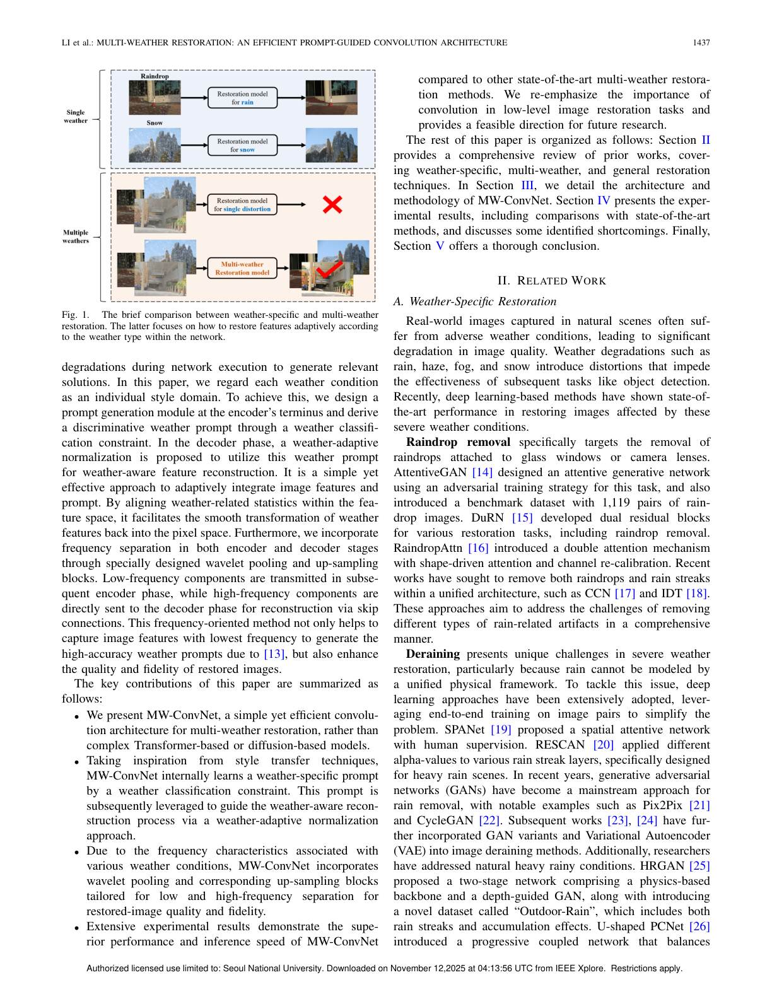
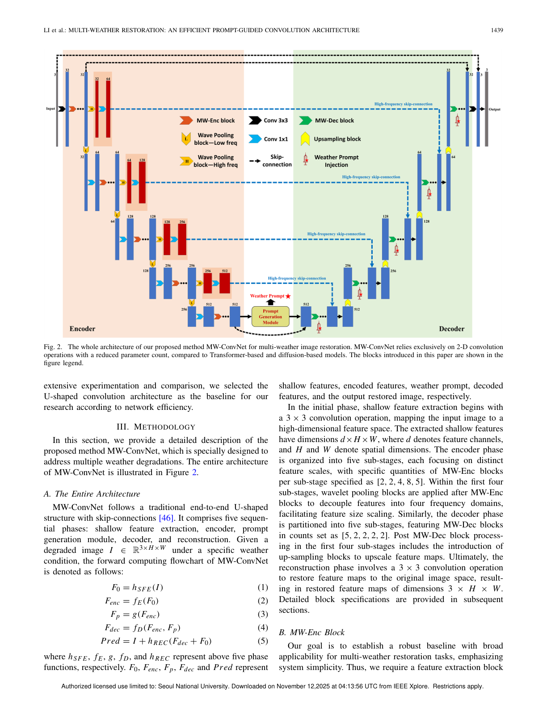
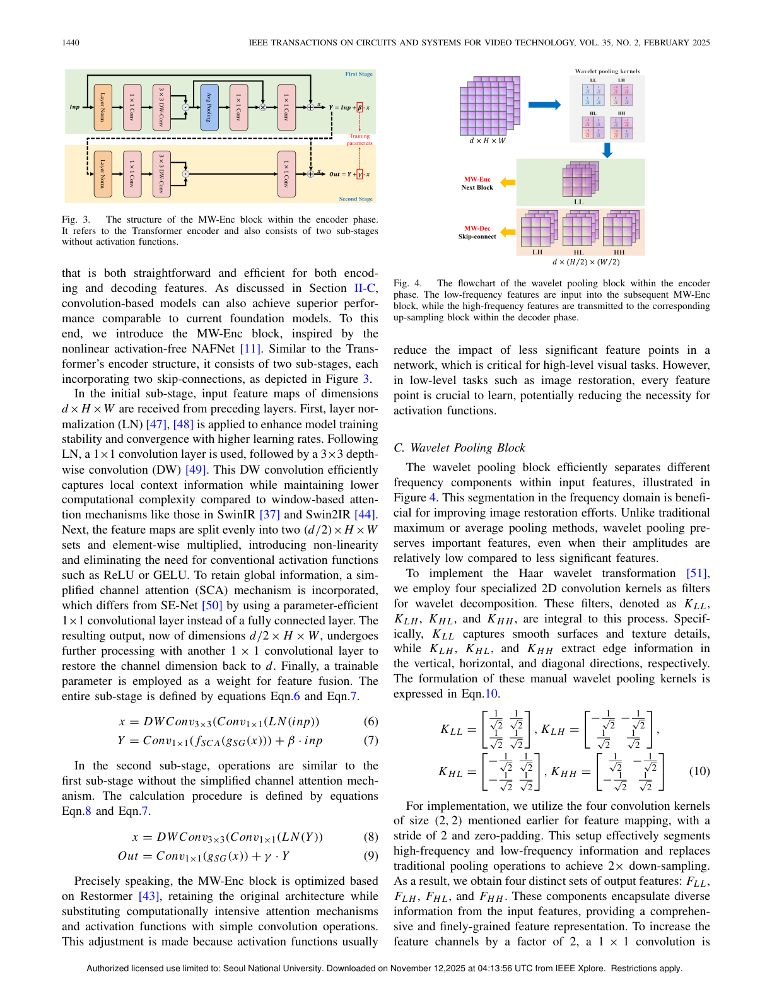
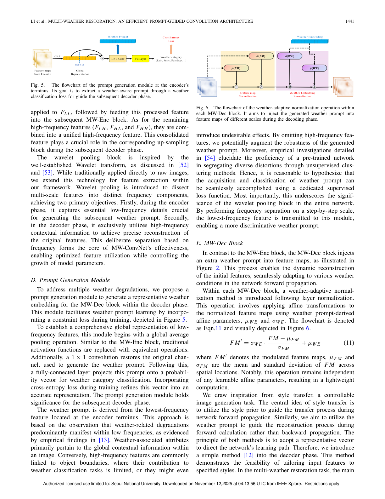

# MWConvNet Implementation Notes

Paper: [Multi-Weather Restoration: An Efficient Prompt-Guided Convolution Architecture](https://ieeexplore.ieee.org/document/10697214)  
Code reference: `MWConvnet.py`

이 문서는 논문의 핵심 그림을 기준으로, 현재 구현 코드(`MWConvnet.py`)가 어떤 방식으로 대응되는지 정리한 설명 문서입니다.

## 1) 문제 설정 (Paper Fig.1)



논문은 weather-specific(비/눈/안개별 개별 모델) 방식보다, 하나의 네트워크로 다양한 악천후를 복원하는 multi-weather restoration을 목표로 합니다.  
현재 코드도 이 방향을 따르며, 단일 모델 `MWConvNet`에서 prompt를 통해 날씨 조건을 반영하도록 구현되어 있습니다.

## 2) 전체 아키텍처 (Paper Fig.2)



```python
class MWConvNet(nn.Module):
    def __init__(self, in_channels=3, prompt_dim=128, num_stages=5, num_classes=4):
        super(MWConvNet, self).__init__()
        self.chan_dims = [32 * (2 ** i) for i in range(num_stages)]
        mw_enc_repeat = [2,2,4,8,5]
        mw_dec_repeat = [5,2,2,2,2]

        self.input_proj = nn.Conv2d(in_channels, self.chan_dims[0], kernel_size=3, padding=1)
        ...
        self.prompt_module = PromptModule(
            in_channels=self.chan_dims[-1], prompt_dim=prompt_dim, num_classes=self.num_classes
        )
        self.decoders = nn.ModuleList([
            nn.ModuleList([MWDecBlock(ch, prompt_dim) for _ in range(n)])
            for ch, n in zip(reversed(self.chan_dims), mw_dec_repeat)
        ])
        self.upsamples = nn.ModuleList([
            UpSampleFusionBlock(ch) for ch in self.chan_dims[::-1][:len(self.chan_dims)-1]
        ])
        self.final = nn.Conv2d(self.chan_dims[0], in_channels, kernel_size=3, padding=1)
```

- `input_proj`: shallow feature 추출
- Encoder: stage 1~5에서 특징 추출, stage 1~4는 wavelet pooling으로 LF/HF 분해
- `prompt_module`: 최종 저주파 특징에서 weather prompt 생성
- Decoder: prompt-conditioned block(`MWDecBlock`)으로 복원
- `upsamples`: skip feature와 결합하며 해상도 복원
- `final + x`: 최종 residual 복원

## 3) Encoder Core: MW-Enc Block + Wavelet Pooling (Paper Fig.3/4)



```python
class MWEncBlock(nn.Module):
    def __init__(self, channels):
        super(MWEncBlock, self).__init__()
        self.ln1 = nn.LayerNorm(channels)
        self.conv1_1 = nn.Conv2d(channels, channels, kernel_size=1, padding=0, bias=True)
        self.dwconv3_1 = nn.Conv2d(channels, channels, kernel_size=3, padding=1, groups=channels, bias=True)
        self.sca = SCA(channels)
        self.conv1_2 = nn.Conv2d(channels//2, channels, kernel_size=1, padding=0, bias=True)
        self.beta = nn.Parameter(torch.zeros(1))
        ...

    def forward(self, x):
        y = self.ln1(x.permute(0, 2, 3, 1)).permute(0, 3, 1, 2)
        y = self.conv1_1(y)
        y = self.dwconv3_1(y)
        y1, y2 = torch.chunk(y, 2, dim=1)
        y = y1 * y2
        y_sca = self.sca(y)
        Y = y_sca*y
        Y = self.conv1_2(Y)
        y = x + self.beta * Y
        ...
        return out
```

- 활성함수 없이(`ReLU/GELU 없음`) 곱셈 게이팅(`y1 * y2`)으로 비선형성 확보
- depthwise + pointwise 조합으로 계산량 절감
- `beta`, `gamma`를 학습해 residual 기여도를 안정적으로 조절
- `SCA`는 경량 채널 어텐션으로 중요한 채널 반응을 강화

```python
class WaveletPooling(nn.Module):
    def __init__(self, out_channels):
        super(WaveletPooling, self).__init__()
        ...
        self.conv = nn.Conv2d(out_channels*3, out_channels, kernel_size=1, bias=True)

    def forward(self, x):
        out = F.conv2d(x, filters, stride=2, padding=0, groups=C)
        out = out.view(B, C, 4, H // 2, W // 2)
        F_LL, F_LH, F_HL, F_HH = out[:, :, 0], out[:, :, 1], out[:, :, 2], out[:, :, 3]
        low_freq = F_LL
        high_freq = torch.cat([F_LH, F_HL, F_HH], dim=1)
        high_freq = self.conv(high_freq)
        return low_freq, high_freq
```

- Haar wavelet으로 downsample하면서 주파수 분해를 동시에 수행
- `low_freq`는 다음 encoder stage로 전달
- `high_freq`는 skip connection으로 decoder 복원 품질 개선에 사용

## 4) Prompt 생성 및 Decoder 정규화 (Paper Fig.5/6)



```python
class PromptModule(nn.Module):
    def __init__(self, in_channels, prompt_dim=128, num_classes=3):
        super(PromptModule, self).__init__()
        self.pool = nn.AdaptiveAvgPool2d(1)
        self.conv1x1 = nn.Conv2d(in_channels, prompt_dim, kernel_size=1, bias=True)
        self.fc = nn.Linear(prompt_dim, num_classes)

    def forward(self, x):
        x = self.pool(x)
        x = self.conv1x1(x)
        prompt = x.view(x.size(0), -1)
        logits = self.fc(prompt)
        return prompt, logits
```

- encoder 최종 특징에서 global context를 압축해 weather-aware prompt 벡터 생성
- `logits`는 날씨 분류 보조학습(학습 시) 용도로 사용 가능

```python
class MWDecBlock(nn.Module):
    def forward(self, x, prompt):
        mu_f = x.mean(dim=(2, 3), keepdim=True)
        std_f = x.std(dim=(2, 3), keepdim=True) + 1e-6
        mu_we = self.affine_mu(prompt).unsqueeze(-1).unsqueeze(-1)
        std_we = self.affine_std(prompt).unsqueeze(-1).unsqueeze(-1)
        x_norm = std_we * (x - mu_f) / std_f + mu_we
        ...
        return x_norm + self.gamma * y
```

- prompt로부터 affine 계수(`mu_we`, `std_we`)를 생성
- feature 통계(`mu_f`, `std_f`)를 날씨 조건에 맞춰 재정렬하는 방식
- 논문에서 제시한 weather-adaptive normalization 아이디어를 코드로 구현한 핵심 부분

## 5) Skip 결합 업샘플링

```python
class UpSampleFusionBlock(nn.Module):
    def forward(self, dec_feat, skip_feat):
        fused = dec_feat + skip_feat
        fused = self.fuse_conv(fused)
        upsampled = self.pixel_shuffle(fused)
        return upsampled
```

- decoder 특징과 encoder skip 특징을 더해 정보 융합
- `1x1 conv + PixelShuffle`로 해상도 2배 복원
- wavelet 기반 skip의 고주파 정보가 디테일 복원에 직접 기여

## 6) Forward 흐름 요약

```python
def forward(self, x):
    x_shallow = self.input_proj(x)
    lf, hf = self.stage_1_enc(x_shallow); skips.append(self.stage_1_1x1(hf))
    lf, hf = self.stage_2_enc(lf);        skips.append(self.stage_2_1x1(hf))
    lf, hf = self.stage_3_enc(lf);        skips.append(self.stage_3_1x1(hf))
    lf, hf = self.stage_4_enc(lf);        skips.append(self.stage_4_1x1(hf))
    weather_prompt = self.stage_5_enc(lf)
    prompt, logits = self.prompt_module(weather_prompt)
    ...
    out = self.final(x_feat + x_shallow) + x
    return out, logits, prompt
```

핵심 포인트:
- encoder에서 파형 분해 기반 skip을 축적
- bottleneck에서 prompt 추출
- decoder 전 단계가 동일 prompt 조건을 공유하며 복원
- 마지막에 입력 이미지 residual을 더해 안정적 복원

---
