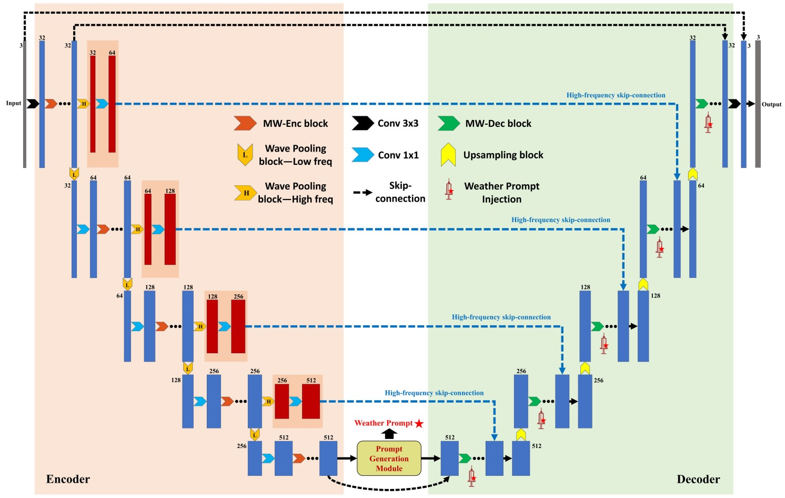
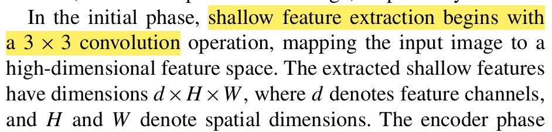
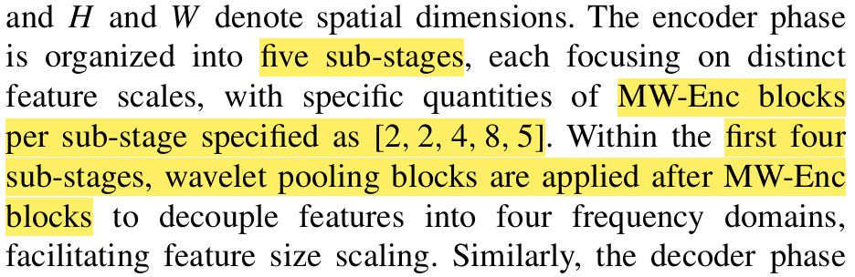

# MWConvNet-implementation
[Multi-Weather Restoration: An Efficient Prompt-Guided Convolution Architecture](https://ieeexplore.ieee.org/document/10697214)

## Model Architecture


//*
## Modules
### shallow feature extractor

```python
# __init__ ...

self.chan_dims = [32*(2**i) for i in range(num_stage)] # num_stage : 5
self.input_proj = nn.Conv2d(in_channels, self.chan_dims[0], kernel_size=3, padding=1) # shallow feature extractor
```
### Encoder blocks

```python
# __init__ ...
mw_enc_repeat = [2,2,4,8,5]
# -----------------------------
# stage 1
# -----------------------------
self.stage_1_enc = nn.Sequential(
    *[MWEncBlock(self.chan_dims[0]) for _ in range(mw_enc_repeat[0])],
    WaveletPooling(self.chan_dims[0]),
)
self.stage_1_1x1 = nn.Conv2d(self.chan_dims[0], self.chan_dims[1], kernel_size=1, bias=True) # skip connection 용도(high frequency가 input)

# -----------------------------
# stage 2
# -----------------------------
self.stage_2_enc = nn.Sequential(
    nn.Conv2d(self.chan_dims[0], self.chan_dims[1], kernel_size=1, bias=True), # low frequency가 input
    *[MWEncBlock(self.chan_dims[1]) for _ in range(mw_enc_repeat[1])],
    WaveletPooling(self.chan_dims[1])
)
self.stage_2_1x1 = nn.Conv2d(self.chan_dims[1], self.chan_dims[2], kernel_size=1, bias=True) # skip connection 용도(high frequency가 input)

# -----------------------------
# stage 3
# -----------------------------
self.stage_3_enc = nn.Sequential(
    nn.Conv2d(self.chan_dims[1], self.chan_dims[2], kernel_size=1, bias=True), # low frequency가 input
    *[MWEncBlock(self.chan_dims[2]) for _ in range(mw_enc_repeat[2])],
    WaveletPooling(self.chan_dims[2])
)
self.stage_3_1x1 = nn.Conv2d(self.chan_dims[2], self.chan_dims[3], kernel_size=1, bias=True) # skip connection 용도(high frequency가 input)

# -----------------------------
# stage 4
# -----------------------------
self.stage_4_enc = nn.Sequential(
    nn.Conv2d(self.chan_dims[2], self.chan_dims[3], kernel_size=1, bias=True), # low frequency가 input
    *[MWEncBlock(self.chan_dims[3]) for _ in range(mw_enc_repeat[3])],
    WaveletPooling(self.chan_dims[3])
)
self.stage_4_1x1 = nn.Conv2d(self.chan_dims[3], self.chan_dims[4], kernel_size=1, bias=True) # skip connection 용도(high frequency가 input)
self.stage_5_enc = nn.Sequential(
    nn.Conv2d(self.chan_dims[3], self.chan_dims[4], kernel_size=1, bias=True), # low frequency가 input
    *[MWEncBlock(self.chan_dims[4]) for _ in range(mw_enc_repeat[4])],
)      
```
*//
